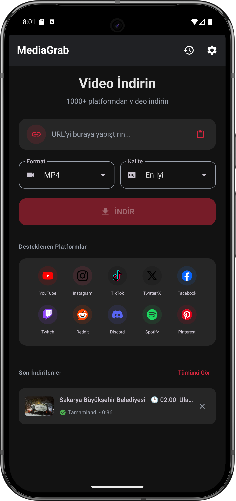

# MediaGrab

<p align="center">
  
</p>

<p align="center">
  <b>Video ve ses indirme uygulaması</b>
</p>

<p align="center">
  <a href="https://github.com/beratr061/MediaGrab-Mobile/releases/latest">
    
  </a>
  <a href="https://github.com/beratr061/MediaGrab-Mobile/actions">
    
  </a>
</p>

---

## 📱 Ekran Görüntüsü

<p align="center">
  
</p>

---

## ✨ Özellikler

- 🎬 YouTube, Instagram, Twitter, TikTok ve 1000+ siteden video indirme
- 🎵 MP3 formatında ses çıkarma
- 📊 Gerçek zamanlı indirme ilerlemesi
- 🎨 Modern Material Design 3 arayüzü
- 📁 İndirme geçmişi ve yönetimi
- 🌙 Karanlık tema desteği

---

## 🔧 Desteklenen Platformlar

| Platform | Durum |
|----------|-------|
| YouTube | ✅ |
| Instagram | ✅ |
| Twitter/X | ✅ |
| TikTok | ✅ |
| Facebook | ✅ |
| Vimeo | ✅ |
| Dailymotion | ✅ |
| +1000 site | ✅ |

---

## 📥 Kurulum

1. [Releases](https://github.com/beratr061/MediaGrab-Mobile/releases) sayfasından en son APK'yı indirin
2. APK dosyasını telefonunuzda açın
3. "Bilinmeyen kaynaklardan yükleme" izni verin
4. Uygulamayı yükleyin

---

## 🛠️ Derleme

```bash
# Repoyu klonlayın
git clone https://github.com/beratr061/MediaGrab-Mobile.git
cd MediaGrab-Mobile

# Debug APK derleyin
./gradlew assembleDebug

# APK konumu: app/build/outputs/apk/debug/app-debug.apk
```

---

## 📋 Gereksinimler

- Android 8.0 (API 26) veya üzeri
- arm64-v8a veya x86_64 işlemci mimarisi

---

## 🔒 İzinler

- `INTERNET` - Video indirmek için
- `WRITE_EXTERNAL_STORAGE` - Dosyaları kaydetmek için
- `FOREGROUND_SERVICE` - Arka planda indirme için

---

## 📄 Lisans

Bu proje MIT lisansı altında lisanslanmıştır.

---

<p align="center">
  Made with ❤️ by <a href="https://github.com/beratr061">Berat</a>
</p>
